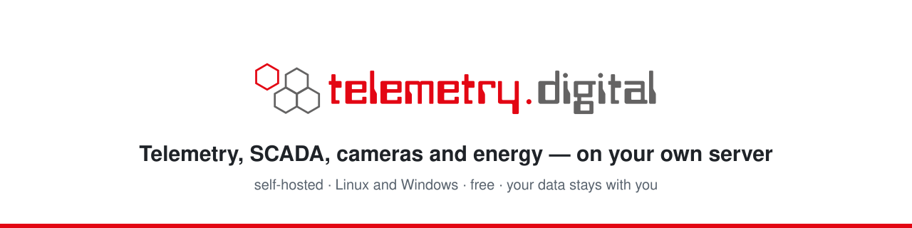

<div align="center">

<picture>
  <source media="(prefers-color-scheme: dark)" srcset="media/banner-dark.svg">
  
</picture>

Devices and PLCs, dashboards and process screens, IP cameras with recording, energy meters, automation flows and
reports in one self-hosted system. Your data stays with you, and an AI assistant can work in it on your behalf.

[Website](https://telemetry.digital) ·
[Portal](https://portal.telemetry.digital) ·
[Install](#install) ·
[What it does](#what-it-does) ·
[Video NVR](#video-nvr)

</div>

---

## What it does

| | |
|---|---|
| **Devices and data** | MQTT (TLS), HTTP, LoRaWAN through ChirpStack, OPC UA and Modbus TCP — reading and writing. Provisioning with claim codes, firmware updates (FOTA) with campaigns, a remote console, commands with acknowledgement. Client libraries for Arduino and ESP-IDF (STM32 to follow). |
| **Dashboards and SCADA** | Dashboards with 40+ widgets, process screens drawn with a vector editor and a library of industrial symbols, displays (kiosks) and video walls. |
| **Cameras** | RTSP/ONVIF cameras with continuous or event recording, PTZ, motion detection, sound, privacy masks, locked evidence with signed export, cameras on a floor plan. Remote sites through an encrypted relay — no open ports. |
| **Energy and logs** | Consumption per meter, hour, day and month; period tables (e.g. a daily temperature log of a medicine fridge) exported to Excel, CSV and a PDF report. |
| **Automation** | Visual flows, rules and alarms with escalation by e-mail, webhook, SMS, voice and Web Push; smart-home devices recognized automatically. |
| **Records you can prove** | Append-only observations, a hash-chained audit trail with a reason for every change, two-factor sign-in, roles and permissions, organizations as separate tenants. |
| **AI assistants (MCP)** | AI assistants (MCP clients) work in the system through the same API and permissions as the user who approved them; every change carries a reason and is audited. Off until an administrator switches it on. |
| **Apps** | Installable apps (PWA) for phones and tablets, e.g. a camera app that shows only the cameras. 19 languages. |

## Video NVR

A complete network video recorder on your own server — for a warehouse, a yard, a shop or a whole site, with the
recordings staying with you.

- **Cameras**: RTSP and ONVIF IP cameras (H.264, H.265, MJPEG), discovery in the local network, presets for common
  brands; tested with 128 cameras on one server.
- **Recording**: continuous or on events (with pre- and post-recording), retention per camera and a disk limit;
  motion from ONVIF events or detected on the server.
- **Viewing**: live view and timeline playback in the browser, speeds up to 16×, MP4 export, sound (AAC, Opus,
  G.711), PTZ with presets.
- **Video walls and displays**: walls over several monitors, kiosk displays paired with a code, a camera enlarged
  automatically on an event, cameras on a floor plan of the site.
- **Phone app**: an installable camera app (PWA) for Android and iPhone that shows only the cameras.
- **Privacy and evidence**: privacy masks, access per camera group, an audit of who watched what, recordings locked
  as evidence and exported as a signed package (SHA-256).
- **Remote sites**: an encrypted relay (Linux, Raspberry Pi, Windows) sends the video of cameras at another site — no
  open ports and no VPN there.

## Install

One command on Linux (Debian, Ubuntu, Raspberry Pi OS 64-bit) or Windows; PostgreSQL is installed with it.

```bash
# Linux, with your domain and automatic HTTPS
curl -fsSL https://telemetry.digital/install.sh | sudo bash -s -- --domain telemetry.example.com
```

```powershell
# Windows (elevated PowerShell)
irm https://telemetry.digital/install.ps1 -OutFile install.ps1; .\install.ps1
```

At a customer's site without a public address, the installers connect the server to a **Cloudflare Tunnel**
(`--cloudflare-token` / `-CloudflareToken`): reachable at the customer's own address, no open ports.

## Repositories

| Repository | What is in it |
|---|---|
| [`kiosk_setup_raspberry`](https://github.com/telemetry-digital/kiosk_setup_raspberry) | Fullscreen Chromium kiosk on Raspberry Pi OS Lite (CM4/CM5, DSI touch displays). |
| [`TM_update`](https://github.com/telemetry-digital/TM_update) | Firmware catalogue for over-the-air updates of inoCORE32 boards. |

## Before you rely on it

telemetry.digital carries **no certification** — not a functional-safety rating, not a type approval and not a
validated GxP system by itself. Safety functions are hard-wired, never through a dashboard or a flow. For recordings of
people you are the data controller: set retention, privacy masks and access according to the law of your country.

---

<div align="center">
<sub>© 2026 Pavol Krnáč · <a href="https://telemetry.digital">telemetry.digital</a> · built on <a href="https://ctrl32.com">ctrl32</a></sub>
</div>
